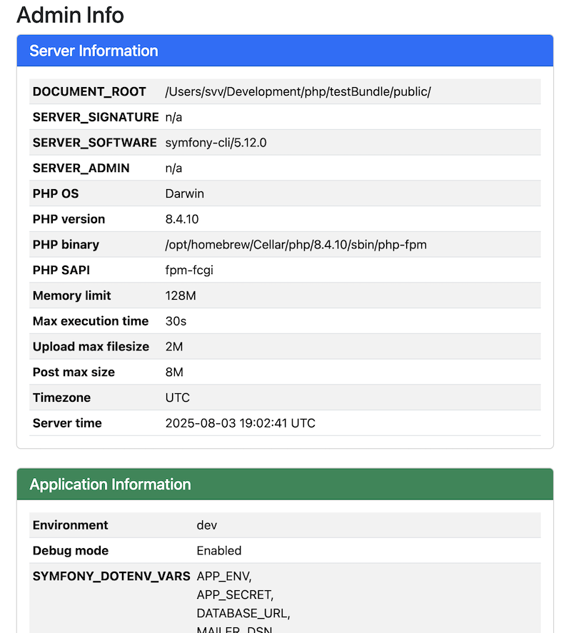

# EnvInfoController

Display information about the current environment in a twig template

## Path

Use the path '*svc_envinfo_info*' to call the environment info twig page

## Route

You can adapt the route in config/routes/svc_util.yaml:

```yaml
# config/routes/svc_util.yaml
_svc_util:
    resource: '@SvcUtilBundle/config/routes.yaml'
    prefix: /svc-profile/{_locale}
```

## Example
