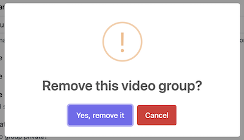

# Stimulus controllers

## clipboard

Copy a text to the clipboard

_Example_
```html
<span data-controller="svc--util-bundle--clipboard" class="d-none d-grid"
  {{ stimulus_controller('svc--util-bundle--clipboard', { 
    'link': copyUrl
  } ) }}
>
  <button type="button" class="btn btn-warning btn-sm" data-action="svc--util-bundle--clipboard#copy" title='Copy link to clipboard'>Copy link</button>
</span>
```

## mclipboard

Copy 1-4 texts to the clipboard (with only one instance of the stimulus controller)

_Example_
```html
<span data-controller="svc--util-bundle--mclipboard" class="d-none"
  {{ stimulus_controller('svc--util-bundle--mclipboard', { 
    'link': url('svc_video_run', {id: video.id} ),
    'link1': url('svc_video_run_hn', {id: video.id} ) 
  } ) }}
>
  <div class="btn-group">
    <button type="button" class="btn btn-warning btn-sm" data-action="svc--util-bundle--mclipboard#copy" title='Copy link to clipboard'>Copy link</button>
    <button class="btn btn-warning dropdown-toggle dropdown-toggle-split btn-sm" type="button" data-bs-toggle="dropdown" aria-expanded="false">
        <span class="visually-hidden">Toggle Dropdown</span>
    </button>
    <ul class="dropdown-menu">
      <li><a class='dropdown-item' data-action="svc--util-bundle--mclipboard#copy1">without nav</a></li>
    </ul>
  </div>
</span>
```

## submit-confirm

Nicer confirmation dialog



_Example_
```html
<form method="post" action="{{ path('svc_video_group_delete', {'id': video_group.id}) }}"
  {{ stimulus_controller('svc--util-bundle--submit-confirm', {
    title: 'Remove this video group?' | trans,
    icon: 'warning',
    confirmButtonText: 'Yes, remove it' | trans,
    cancelButtonText: 'Cancel' | trans
  }) }}
  data-action="svc--util-bundle--submit-confirm#onSubmit"
>
```

additional parameters:
* text: some text in the dialog body