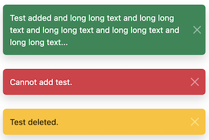

# Flash messages

display symfony flash messages via bootstrap toast (needs bootstrap... - and stimulus for the controller)



## Usage

call the template in your base template (base.html.twig)

```twig

```